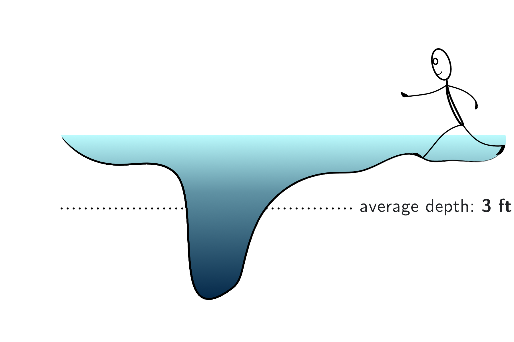
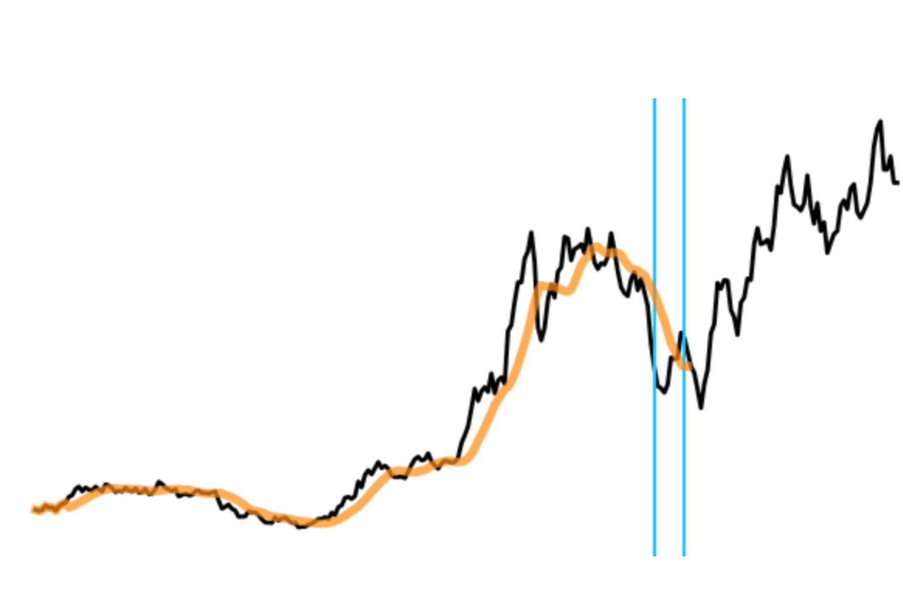
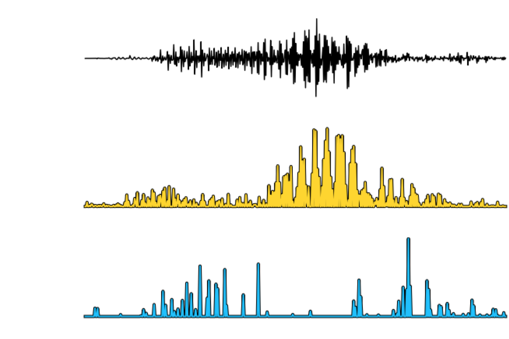
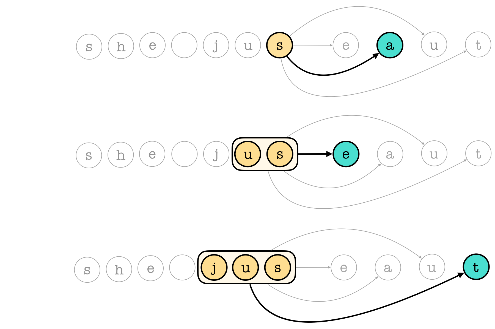
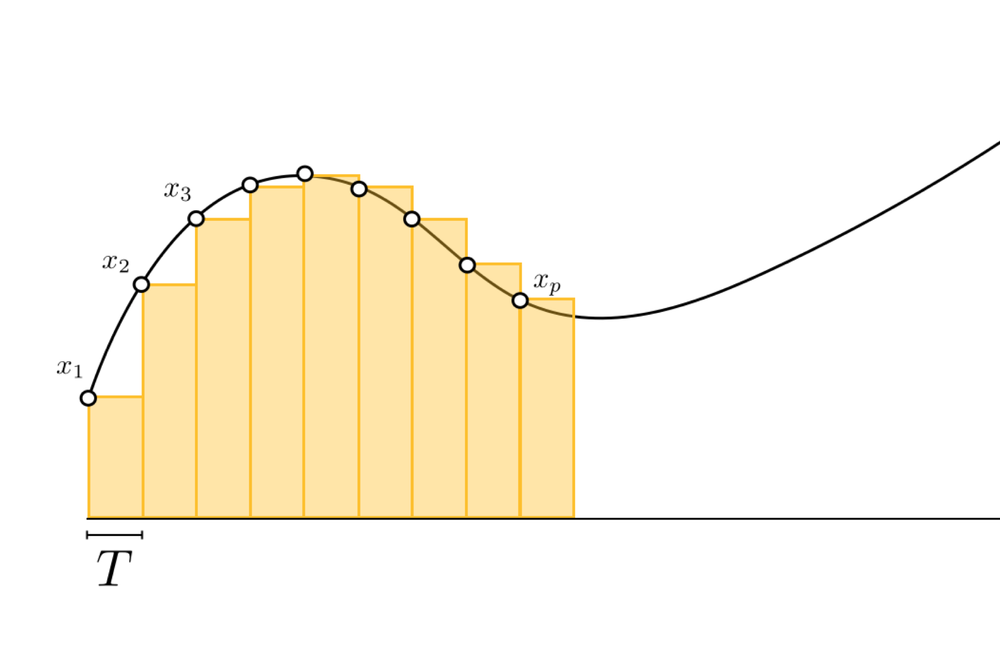
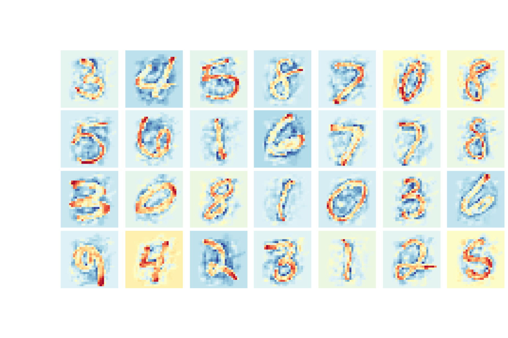

# A collection of notebooks on Dynamic Systems, Automatic Control, and Reinforcement Learning

## Current topics
[(Back to top)](#table-of-contents)

### Dynamic Systems

 |  |  
---|---|---
[Moving averages](https://jermwatt.github.io/control-notes/posts/moving_averages/Moving_averages.html) | [1D convolutions](https://jermwatt.github.io/control-notes/posts/one_dimensional_convolutions/One_dimensional_convolutions.html) | [Dynamic systems with limited memory](https://jermwatt.github.io/control-notes/posts/dynamic_systems_limited_memory/dynamic_systems_limited_memory.html)

  

 |  | 
---|---|---
[Markov chains and stochastic recurrence relations](https://jermwatt.github.io/control-notes/posts/markov_chains/Markov_chains.html) | [Dynamic systems with unlimited memory](https://jermwatt.github.io/control-notes/posts/dynamic_systems_unlimited_memory/dynamic_systems_unlimited_memory.html)| &nbsp;

   

### Data preprocessing and feature normalization

 |  | 
---|---|---
[ZCA sphereing](https://jermwatt.github.io/control-notes/posts/zca_sphereing/ZCA_Sphereing.html) | &nbsp; | &nbsp;
 
   
## Installation
[(Back to top)](#table-of-contents)

To successfully run the Jupyter notebooks contained in this repo we highly recommend downloading the [Anaconda Python 3 distribution](https://www.anaconda.com/download/#macos). Many of these notebooks also employ the Automatic Differentiator [autograd](https://github.com/HIPS/autograd) which can be installed by typing the following command at your terminal
      
      pip install autograd
      
With minor adjustment users can also run these notebooks using the GPU/TPU extended version of autograd [JAX](https://github.com/google/jax).   

## Creators 

[(Back to top)](#table-of-contents) 

This repository is in active development by [Jeremy Watt](mailto:jeremy@dgsix.com) and [Reza Borhani](mailto:reza@dgsix.com) - please do not hesitate to reach out with comments, questions, typos, etc.
